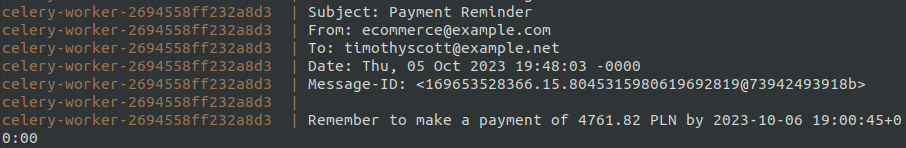
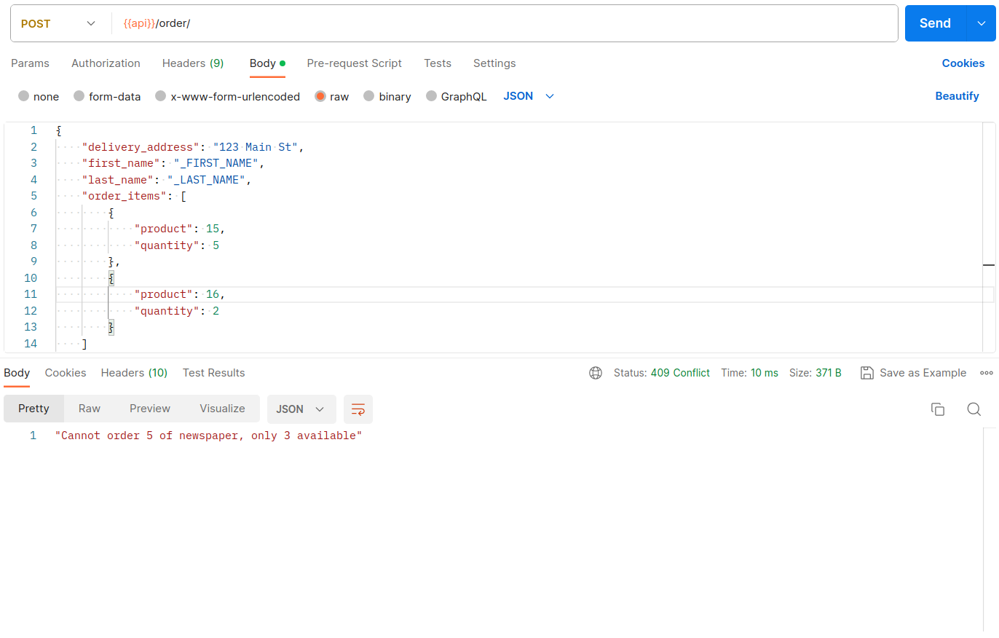

# django-e-commerce

## Run with docker

```bash
make d
```

or

```bash
docker compose -p e-commerce-app-9c06b9f13011495c -f docker/docker-compose.dev.yml --env-file .env up --build
```

## Apps

- `FRONTEND CLIENT` -> `http://localhost:5173/`
- `API` -> `http://localhost:8000/api`

## Postman

- Postman collection and environment in `postman`
- All Postman screenshots in `doc/img/postman`

## Additional Features
- Send Payment Reminder Task with Celery
  
- Ensure that the product quantity does not exceed the quantity available in stock when make order.
  

## Frontend demo
- CLIENT post order


https://github.com/adas77/django-e-commerce/assets/73692470/fb39b198-55d2-4764-a93c-8e9b8f0e33b4


- SELLER update/delete product


https://github.com/adas77/django-e-commerce/assets/73692470/d153e309-dfca-42e2-86c8-e385717c8e0d


- UNAUTHORIZED list/sort/filter products


https://github.com/adas77/django-e-commerce/assets/73692470/c6ccd96a-72ef-4ba5-84c6-b8b51e0f101f


